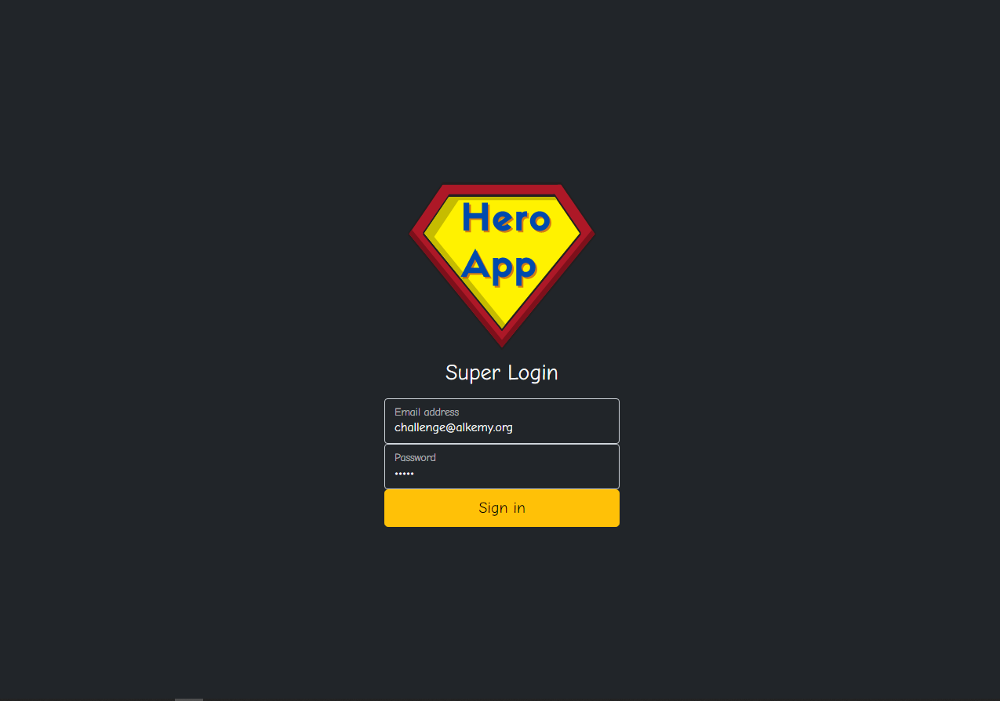
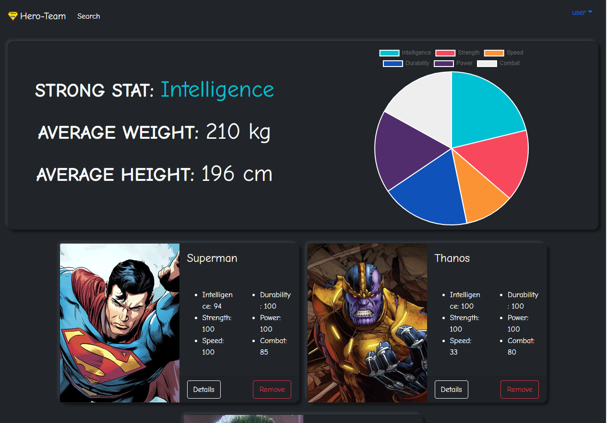
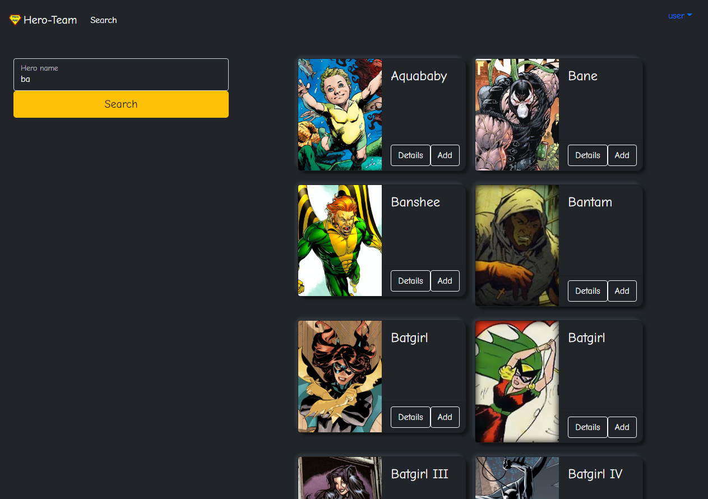

# Hero App (Challenge React Alkemy )

Aplicación para crear un equipo de superhéroes que consumirá una API externa y
mostrará diferentes atributos a nivel individual de cada miembro y del equipo consolidado.

Challenge: [Alkemy Challenge React](https://drive.google.com/file/u/0/d/1kNbni3fBBYiAErWYIQNmlggJTNHmLgPL/view)

Alkemy : [Sitio Web](https://www.alkemy.org/)





### Built With 🛠️


* [React.js](https://es.reactjs.org/)
* [Redux](https://es.redux.js.org/)
* [css](https://sass-lang.com/)
* [bootstrap](https://getbootstrap.com/)
* [SuperHero Api](https://superheroapi.com/)


## Getting Started 🚀

Este es un ejemplo de cómo puede dar instrucciones sobre cómo configurar su proyecto localmente.
Para obtener una copia local en funcionamiento, siga estos sencillos pasos de ejemplo.

### Installation

1. Clone the repo
   ```sh
   git clone https://github.com/DiegoRodriguez-sc/super-hero-app.git
   ```
2. Install NPM packages
   ```sh
   npm install
   ```
3. Run `Super-hero-app`
   ```sh
   npm start
   ```


## Contact ☎️

 * [Linkedin](www.linkedin.com/in/diego-rodriguez-sc)

* Project Link: [https://github.com/DiegoRodriguez-sc/super-hero-app](https://github.com/DiegoRodriguez-sc/super-hero-app)